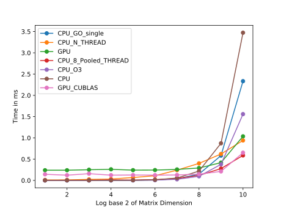
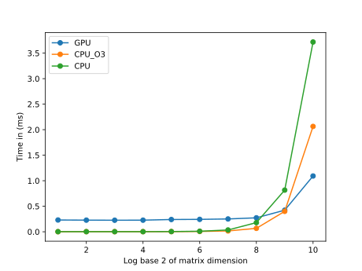
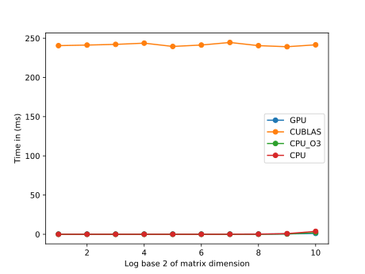

### TestCases 

To generate test cases, run the `Test_Generator.py -N` file, where N is the dimenstion of the matrix 

### How to Run 

Run the `run.sh` script present in each directory to run the experiments.

> `./run.sh`

### Individual Run

To compile each program individually, see the `run.sh` .  Preferable method is to comment out unnecessary part of `run.sh` files. 

### Plot

Plots can be generated by `Gen_Plots.py`, exeution time has to be filled manually in the script.

### Observation

#### sgemv
> Note : Y_Axis shows exection time in ms, and X_axis shows dimension of matrix [2^i X 2^i]
  

- sgemv : CPU with 8 thread pools were beating, cuda's Cuda experiments.
- CPU_GO_Single: Single threaded CPU implementation in Go
- CPU_N_THREAD : Multiple threads spawned simpultanously on CPU 
- GPU : GPU implementation 
- CPU_8_Pooled_THREAD : a pool of 8 worker threads 
- CPU_O3 : C code compiled with -O3 optimisation enabled in gcc
- CPU : C code compiled with no optimsation
- GPU_CUBLAS : CUBLAS Library 

#### dtpmv

  

- GPU : GPU implementation 
- GPU_CUBLAS : CUBLAS Library 
- CPU : C code compiled with no optimsation
- CPU_O3 : C code compiled with -O3 optimisation enabled in gcc

- dtpmv : cublas impementation was the slowest. 

### Limitiation

Experiments of matrix above size `1024 X 1024` cannot be performed (on my pc) due to memory limitation.
